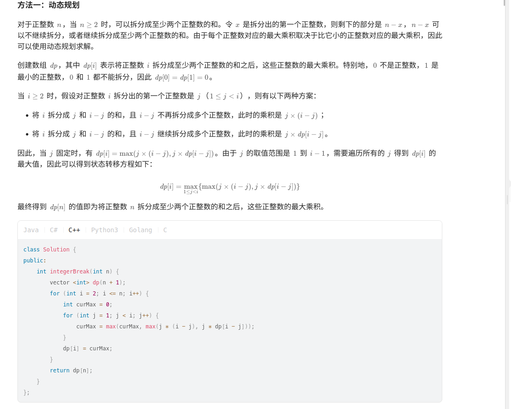

# 说明

```Cpp
class Solution {
public:
    int integerBreak(int n) {
        vector<int> dp(n+1);
        for(int i=2; i<=n; i++){
            int curMax = 0;
            for(int j=1; j<i; j++){
                curMax = max(curMax, max(j*(i-j), j*dp[i-j]));
            }
            dp[i] = curMax;
        }
        return dp[n];
    }  
};
```

动态规划： 我最开始是没想到怎么进行动态规划的。因为我认为不好拆分。也就算我没想到怎么用n-1的乘积最大值求n的乘积最大值。

后面看了题解之后发现，还是可以进行动态规划的。

